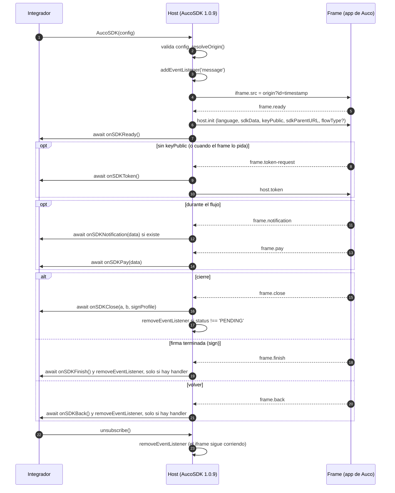

# Protocolo host ⇄ frame de `auco-sdk-integration@1.0.9`

Este documento reconstruye el protocolo `postMessage` entre la página del integrador (el **host**) y la app de Auco que corre dentro del iframe (el **frame**), tal como lo implementa la 1.0.9 en el commit [`bd27a8b`](https://github.com/Lob26/auco-sdk/tree/bd27a8b). Es el contrato del comportamiento que hoy viaja por el cable, no el del protocolo que se quisiera tener: los defectos se documentan, no se corrigen aquí.

- **Alcance:** solo el lado del host. Lo que hace el frame (`sign.auco.ai`, `upload.auco.ai`, …) no se ve desde este repo y queda en [Preguntas abiertas](#4-preguntas-abiertas).
- **Fuentes:** `src/index.ts` y `src/types.ts` en `bd27a8b`; la documentación pública de [docs.auco.ai/sdk](https://docs.auco.ai/sdk/intro); la auditoría [Lob26/auco-sdk#1](https://github.com/Lob26/auco-sdk/issues/1) y la RFC [Lob26/auco-sdk#2](https://github.com/Lob26/auco-sdk/issues/2).
- **Fixtures:** cada mensaje tiene al menos una en [`fixtures/`](./fixtures), con nombre `<id>.json` o `<id>.<variante>.json`. Su campo `data` es exactamente el `MessageEvent.data` que la 1.0.9 lee o envía.

## Cómo leer este documento

**Ids.** Cada mensaje tiene un id estable `frame.*` (frame → host) o `host.*` (host → frame) y una sección con encabezado exacto `` ### `<id>` ``. Una prueba parsea esos encabezados y los cruza con las fixtures en ambas direcciones.

**Confianza.** Cada afirmación lleva una de tres etiquetas:

| Etiqueta | Significa | En las fixtures |
|----------|-----------|-----------------|
| `código` | Se lee en `src/index.ts` o `src/types.ts` en `bd27a8b`. | `"code"` |
| `docs` | Solo aparece en docs.auco.ai; el código no lo confirma ni lo contradice. | `"docs"` |
| `inferido` | Deducción sin fuente directa. Dice de dónde sale. | `"inferred"` |

La etiqueta de un mensaje (y el campo `confidence` de su fixture) califica su **forma**: el predicado con que la 1.0.9 lo reconoce, los nombres y tipos de los campos y la reacción del host. Los **valores** literales de las fixtures son representantes falsos que cumplen ese predicado; no afirman qué manda el frame real. Cuando un valor sale de la documentación (por ejemplo `APPROVED`), la tabla de campos lo indica.

**Productos.** El campo `products` de una fixture lista los `sdkType` cuyo frame manda ese mensaje (o esa variante) según la mejor evidencia disponible, que cada sección cita. Cuando nada restringe un mensaje, se listan los nueve `sdkType`, porque la 1.0.9 lo maneja igual para todos. `list-validation` cuenta: su origen por defecto es `''` en los tres entornos, pero `customOrigin` gana sobre cualquier producto ([§1.1](#11-origen-por-producto-y-entorno), regla 1), así que con `customOrigin` es un camino que funciona. Sin `customOrigin`, en un navegador real no recibe nada, porque ningún `event.origin` serializado es `''` ([§1.3](#13-filtro-del-host)). Un `MessageEvent` sintético con `origin` por defecto (`''`) sí pasa el filtro: las pruebas que despachan eventos a mano lo tienen que tener en cuenta.

## 1. Transporte

Todo viaja por `window.postMessage`. El host escucha con un único listener `message` en `window` ([`src/index.ts#L137`](https://github.com/Lob26/auco-sdk/blob/bd27a8b/src/index.ts#L137)) y le escribe al frame con `iframe.contentWindow.postMessage(data, origin)`. No hay `MessageChannel`, ni versión de protocolo, ni id de correlación. `código`

### 1.1 Origen por producto y entorno

`resolveOrigin` ([`src/index.ts#L177-L192`](https://github.com/Lob26/auco-sdk/blob/bd27a8b/src/index.ts#L177-L192)) elige el origen en este orden, y la primera regla que aplica gana: `código`

1. `customOrigin` no vacío → se usa tal cual, para cualquier producto y entorno ([`#L183`](https://github.com/Lob26/auco-sdk/blob/bd27a8b/src/index.ts#L183)).
2. `env === 'DEV'` y `keyPublic` falsy (ausente o `''`) → mapa interno `internalSDKDevURL` ([`#L189`](https://github.com/Lob26/auco-sdk/blob/bd27a8b/src/index.ts#L189)).
3. `env === 'DEV'` o `env === 'STAGE'` → mapa `getDevSDKURL` ([`#L190`](https://github.com/Lob26/auco-sdk/blob/bd27a8b/src/index.ts#L190)).
4. Cualquier otro valor de `env`, incluido `PROD` → mapa `getSDKURL` ([`#L191`](https://github.com/Lob26/auco-sdk/blob/bd27a8b/src/index.ts#L191)).

| `sdkType` | `PROD` ([`#L141`](https://github.com/Lob26/auco-sdk/blob/bd27a8b/src/index.ts#L141-L151)) | `STAGE`, o `DEV` con `keyPublic` ([`#L153`](https://github.com/Lob26/auco-sdk/blob/bd27a8b/src/index.ts#L153-L163)) | `DEV` sin `keyPublic` ([`#L165`](https://github.com/Lob26/auco-sdk/blob/bd27a8b/src/index.ts#L165-L175)) |
|---|---|---|---|
| `upload` | `https://upload.auco.ai` | `https://upload-stage.auco.ai` | `https://upload-dev.auco.ai` |
| `upload-v2` | `https://uploadv2.auco.ai` | `https://uploadv2-stage.auco.ai` | `https://uploadv2-dev.auco.ai` |
| `read` | `https://upload.auco.ai` | `https://upload-stage.auco.ai` | `https://upload-dev.auco.ai` |
| `attachments` | `https://upload.auco.ai` | `https://upload-stage.auco.ai` | `https://upload-dev.auco.ai` |
| `validation-attachments` | `https://upload.auco.ai` | `https://upload-stage.auco.ai` | `https://upload-dev.auco.ai` |
| `validation` | `https://veriface.auco.ai` | `https://veriface-stage.auco.ai` | `https://veriface-dev.auco.ai` |
| `sign` | `https://sign.auco.ai` | `https://sign-stage.auco.ai` | `https://sign-dev.auco.ai` |
| `fill` | `https://fill2.auco.ai` | `https://fill2-stage.auco.ai` | `https://fill2-stage.auco.ai` |
| `list-validation` | `''` | `''` | `''` |

Consecuencias que se leen en el código:

- `DEV` con `keyPublic` va en silencio a `*-stage`, no a `*-dev`. El comentario de [`#L184-L188`](https://github.com/Lob26/auco-sdk/blob/bd27a8b/src/index.ts#L184-L188) dice que `DEV` sin llave es para apps internas de Auco que se autentican con `onSDKToken`; la doc de `sign` usa justo esa combinación (auditoría 6.2). `código`
- `fill` apunta a `fill2-stage` también en el mapa interno de `DEV` (auditoría 3.6). `código`
- `upload`, `read`, `attachments` y `validation-attachments` comparten origen: dos de ellos en la misma página se oyen entre sí (auditoría 1.1). `código`
- `list-validation` solo funciona con `customOrigin`: sin él, su origen es `''` en los tres mapas. `código`
- Un `sdkType` desconocido llamado desde JavaScript resuelve a `undefined`. `código`
- `customOrigin` se compara literal contra `event.origin`, que por especificación es un origen serializado sin ruta ni `/` final: un `customOrigin` como `https://x.example.com/` no recibe ningún mensaje. `inferido` (especificación de HTML)

### 1.2 Carga del iframe

El host no crea el iframe: lo busca con `document.getElementById(iframeId)` ([`#L59`](https://github.com/Lob26/auco-sdk/blob/bd27a8b/src/index.ts#L59)), registra el listener ([`#L137`](https://github.com/Lob26/auco-sdk/blob/bd27a8b/src/index.ts#L137)) y **después** le asigna `src` ([`#L138`](https://github.com/Lob26/auco-sdk/blob/bd27a8b/src/index.ts#L138)), así que no se pierde un `ready` temprano. `código`

```text
iframe.src = <origin> + '?id=' + <timestamp>
```

`<timestamp>` sale de `uuid()` ([`#L2-L6`](https://github.com/Lob26/auco-sdk/blob/bd27a8b/src/index.ts#L2-L6)): `new Date().toISOString()` con `:` cambiado por `-`, por ejemplo `https://sign.auco.ai?id=2026-10-01T15-04-05.123Z`. No es un UUID: hace de cache-buster. Con origen `''` (`list-validation` sin `customOrigin`) el `src` queda relativo a la página del host, y con origen `undefined` queda `undefined?id=…` (auditoría 1.2). `código`

Validaciones previas que lanzan de forma síncrona, antes de tocar el iframe ([`#L16-L44`](https://github.com/Lob26/auco-sdk/blob/bd27a8b/src/index.ts#L16-L44), [`#L61-L73`](https://github.com/Lob26/auco-sdk/blob/bd27a8b/src/index.ts#L61-L73)): `iframeId` ausente, `language` distinto de `es`/`en`, `custom` truthy que no sea objeto, o un objeto vacío (solo `upload` y `attachments`; un `custom` falsy como `''`, `0` o `false` no se valida), iframe inexistente, y `keyPublic` no vacío con longitud distinta de 36. `código`

También lanzan, como `TypeError` y no con un mensaje propio: `sdkData` ausente en `upload` o `attachments` ([`#L26`](https://github.com/Lob26/auco-sdk/blob/bd27a8b/src/index.ts#L26)), y `events` ausente cuando `keyPublic` tiene una longitud inválida ([`#L67`](https://github.com/Lob26/auco-sdk/blob/bd27a8b/src/index.ts#L67)). `keyPublic: ''` es falsy, así que salta ambas validaciones de llave. `código`

### 1.3 Filtro del host

```ts
if (event.origin !== origin) return; // src/index.ts#L76
```

Es el **único** filtro ([`#L76`](https://github.com/Lob26/auco-sdk/blob/bd27a8b/src/index.ts#L76)). No se compara `event.source` con `iframe.contentWindow`, de modo que cualquier ventana del mismo origen, incluido otro iframe de Auco en la página, entra al despacho (auditoría [1.1](https://github.com/Lob26/auco-sdk/issues/1)). Tampoco se valida la forma de `event.data`. `código`

### 1.4 Despacho

El listener es `async` ([`#L75`](https://github.com/Lob26/auco-sdk/blob/bd27a8b/src/index.ts#L75)) y evalúa en este orden: `código`

1. `frame.ready` y **retorna**: un mensaje que además traiga `type` no se despacha como nada más.
2. Luego una cadena de `if` independientes (no `else if`): `frame.token-request`, `frame.pay`, `frame.notification`, `frame.close`, `frame.finish`, `frame.back`.
3. Un mensaje del origen correcto que no cumple ningún predicado se ignora en silencio, **salvo** que traiga un `type` que no sea `string` ni arreglo (número, booleano, objeto): entonces `type.includes` no existe, el predicado de `frame.token-request` ([`#L91`](https://github.com/Lob26/auco-sdk/blob/bd27a8b/src/index.ts#L91)) lanza `TypeError`, y los predicados siguientes no se evalúan.

Todo `throw` dentro del listener, o un callback del integrador que rechace, termina en un *unhandled promise rejection*: nadie lo atrapa y el frame no se entera (auditoría 1.3). `código`

## 2. Secuencia



Notas de ciclo de vida, todas `código`:

- **`ready` no es idempotente.** Cada `frame.ready` reenvía `host.init` completo y vuelve a llamar `onSDKReady` (auditoría 1.7).
- **El cierre no es uniforme.** `frame.close` quita el listener salvo con `status === 'PENDING'`; `frame.finish` y `frame.back` lo quitan solo si el integrador pasó el handler (auditoría 1.6).
- **Nada toca el iframe al terminar.** Ni los mensajes terminales ni `unsubscribe` ([`#L10-L12`](https://github.com/Lob26/auco-sdk/blob/bd27a8b/src/index.ts#L10-L12)) cambian su `src` ni lo desmontan; llamar `AucoSDK` dos veces sobre el mismo iframe apila listeners.
- **Reentrada.** El host espera (`await`) cada callback, pero el navegador sigue entregando mensajes mientras tanto: un mensaje puede procesarse antes de que termine el callback del anterior. `inferido` (semántica de `async` en un event listener)

## 3. Mensajes

### `frame.ready`

| | |
|---|---|
| Dirección | frame → host |
| Reconocimiento | `event.data.ready` truthy, **sin** optional chaining |
| Productos | Todos. El host lo exige para iniciar cualquier producto. `inferido` |
| Reacción del host | Responde `host.init` ([`#L78-L87`](https://github.com/Lob26/auco-sdk/blob/bd27a8b/src/index.ts#L78-L87)), espera `onSDKReady()` ([`#L88`](https://github.com/Lob26/auco-sdk/blob/bd27a8b/src/index.ts#L88)) y retorna sin evaluar los demás predicados. `onSDKReady` es obligatorio en los tipos pero no se valida al arrancar: si falta, el `TypeError` salta **después** de mandar `host.init` y queda sin atrapar. |
| Terminal | No. Se puede repetir y cada vez reenvía `host.init`. |
| Fuente | [`src/index.ts#L77`](https://github.com/Lob26/auco-sdk/blob/bd27a8b/src/index.ts#L77) |
| Confianza | `código` |
| Fixtures | [`frame.ready.json`](./fixtures/frame.ready.json) |

| Campo | Tipo | Confianza | Nota |
|-------|------|-----------|------|
| `ready` | truthy | `código` | La fixture usa `true`. Se desconoce si el frame manda más campos. |

`event.data` en `null` o `undefined` produce un `TypeError` en este punto, que termina como *unhandled rejection* (auditoría 1.8). `código`

### `frame.token-request`

| | |
|---|---|
| Dirección | frame → host |
| Reconocimiento | `event.data?.type?.includes('token')` |
| Productos | Todos. La doc lo describe para todos y lo incluye en los ejemplos de `upload`, `attachments`, `read` y `fill`; en `read` con email, como token de un usuario de app.auco.ai. `docs` |
| Reacción del host | Si falta `onSDKToken`, lanza ([`#L92-L96`](https://github.com/Lob26/auco-sdk/blob/bd27a8b/src/index.ts#L92-L96)) y el error queda sin atrapar. Si existe, espera `onSDKToken()` ([`#L97`](https://github.com/Lob26/auco-sdk/blob/bd27a8b/src/index.ts#L97)) y responde `host.token`. |
| Terminal | No. |
| Fuente | [`src/index.ts#L91`](https://github.com/Lob26/auco-sdk/blob/bd27a8b/src/index.ts#L91) |
| Confianza | `código` |
| Fixtures | [`frame.token-request.json`](./fixtures/frame.token-request.json) |

| Campo | Tipo | Confianza | Nota |
|-------|------|-----------|------|
| `type` | `string` que contiene `token` (sensible a mayúsculas) | `código` | La fixture usa `"token"`, el valor mínimo que cumple. El literal real que manda el frame se desconoce. `SDK-TOKEN` **no** cumple el predicado. Un arreglo que contenga `'token'` también lo cumple. |

Riesgos que se leen en el código: el predicado es por substring (auditoría 1.5); si `onSDKToken` rechaza o no resuelve, el frame no recibe respuesta, y dos solicitudes concurrentes se responden en el orden en que resuelvan, sin correlación (auditoría 1.4). La doc dice que con `keyPublic` este evento "no es llamado"; el código no lo condiciona a `keyPublic` y responde a cualquier `frame.token-request`. `código` + `docs`

### `frame.pay`

| | |
|---|---|
| Dirección | frame → host |
| Reconocimiento | `event.data?.type === 'SDK-PAY'` |
| Productos | Desconocido. `onSDKPay` existe en los tipos de todos los productos y no aparece en la doc. `list-validation` es el único producto que lo exige (`Required<SDKEvents>`, [`types.ts#L273`](https://github.com/Lob26/auco-sdk/blob/bd27a8b/src/types.ts#L273)) y trae `showPrices`, lo que sugiere que es su emisor; es alcanzable solo con `customOrigin` (§1.1). La fixture lista los nueve. `inferido` |
| Reacción del host | Si falta `onSDKPay`, lanza ([`#L101-L105`](https://github.com/Lob26/auco-sdk/blob/bd27a8b/src/index.ts#L101-L105)) sin que nadie lo atrape. Si existe, espera `onSDKPay(event.data.data)` ([`#L106`](https://github.com/Lob26/auco-sdk/blob/bd27a8b/src/index.ts#L106)). No responde nada al frame. |
| Terminal | No. |
| Fuente | [`src/index.ts#L100`](https://github.com/Lob26/auco-sdk/blob/bd27a8b/src/index.ts#L100) |
| Confianza | `código` |
| Fixtures | [`frame.pay.json`](./fixtures/frame.pay.json) |

| Campo | Tipo | Confianza | Nota |
|-------|------|-----------|------|
| `type` | `'SDK-PAY'` | `código` | |
| `data` | `object` | `código` | Se pasa tal cual a `onSDKPay`; el host no lo valida. |
| `data.code` | `string` | `código` ([`types.ts#L23`](https://github.com/Lob26/auco-sdk/blob/bd27a8b/src/types.ts#L22-L27)) | Forma declarada por el tipo del host, no verificada en runtime. |
| `data.epaycoKey` | `string` | `código` ([`types.ts#L24`](https://github.com/Lob26/auco-sdk/blob/bd27a8b/src/types.ts#L22-L27)) | Ídem. |
| `data.validation` | `boolean`, opcional | `código` ([`types.ts#L25`](https://github.com/Lob26/auco-sdk/blob/bd27a8b/src/types.ts#L22-L27)) | Ídem. |
| `data.packageId` | `string`, opcional | `código` ([`types.ts#L26`](https://github.com/Lob26/auco-sdk/blob/bd27a8b/src/types.ts#L22-L27)) | Ídem. |

### `frame.notification`

| | |
|---|---|
| Dirección | frame → host |
| Reconocimiento | `event.data?.type === 'SDK-NOTIFICATION'` |
| Productos | Desconocido: no aparece en la doc y los tipos lo permiten en todos. La fixture lista los nueve. `inferido` |
| Reacción del host | Si existe `onSDKNotification`, espera `onSDKNotification(event.data.data)` ([`#L110`](https://github.com/Lob26/auco-sdk/blob/bd27a8b/src/index.ts#L110)). Si no existe, lo ignora en silencio (a diferencia de `frame.pay`). |
| Terminal | No. |
| Fuente | [`src/index.ts#L108`](https://github.com/Lob26/auco-sdk/blob/bd27a8b/src/index.ts#L108) |
| Confianza | `código` |
| Fixtures | [`frame.notification.json`](./fixtures/frame.notification.json) |

| Campo | Tipo | Confianza | Nota |
|-------|------|-----------|------|
| `type` | `'SDK-NOTIFICATION'` | `código` | |
| `data` | `object` | `código` | Se pasa tal cual al callback. |
| `data.message` | `string` | `código` ([`types.ts#L32`](https://github.com/Lob26/auco-sdk/blob/bd27a8b/src/types.ts#L28-L34)) | |
| `data.options` | `NotificationOptions` del DOM | `código` el campo, `inferido` su forma | El tipo es el de la *Web Notifications API*, probablemente por accidente (auditoría 3.3). La fixture usa `{}` para no inventar subcampos. |

### `frame.close`

| | |
|---|---|
| Dirección | frame → host |
| Reconocimiento | `event.data?.type === 'SDK-CLOSE'` |
| Productos | La doc lo muestra para `upload`, `sign` y `validation`; los tipos le dan una firma propia a `upload`/`upload-v2` y a `validation`. `docs` + `código` |
| Reacción del host | Espera `onSDKClose(a, b, c)` ([`#L114-L118`](https://github.com/Lob26/auco-sdk/blob/bd27a8b/src/index.ts#L114-L118)) con los argumentos de abajo. Después quita el listener **salvo** que `status === 'PENDING'` ([`#L119-L120`](https://github.com/Lob26/auco-sdk/blob/bd27a8b/src/index.ts#L119-L120)). Si `onSDKClose` no existe (es obligatorio en los tipos, pero no se valida) o su promesa rechaza, el error queda sin atrapar y el listener sigue registrado. |
| Terminal | Sí, salvo `status === 'PENDING'`. |
| Fuente | [`src/index.ts#L113`](https://github.com/Lob26/auco-sdk/blob/bd27a8b/src/index.ts#L113) |
| Confianza | `código` |
| Fixtures | [`frame.close.upload.json`](./fixtures/frame.close.upload.json), [`frame.close.sign.json`](./fixtures/frame.close.sign.json), [`frame.close.validation.json`](./fixtures/frame.close.validation.json), [`frame.close.validation-pending.json`](./fixtures/frame.close.validation-pending.json) |

El host aplana todas las variantes en tres argumentos posicionales, con `??` (solo `null`/`undefined` caen al siguiente; `0` y `''` no): `código`

```ts
onSDKClose(
  data.document ?? data.similarity ?? '',   // a
  data.redirectTo ?? data.status ?? '',     // b
  data.signProfile ?? []                    // c
)
```

El significado de cada posición depende del producto (auditoría 3.2). Variantes:

**`upload`** (`upload`, `upload-v2`) → `onSDKClose(document, redirectTo ?? status ?? '', signProfile)`

| Campo | Tipo | Confianza | Nota |
|-------|------|-----------|------|
| `type` | `'SDK-CLOSE'` | `código` | |
| `document` | `string` | `código` ([`#L115`](https://github.com/Lob26/auco-sdk/blob/bd27a8b/src/index.ts#L115)), `docs` | Código del documento creado, según la doc. |
| `signProfile` | `Array<{ id: string; name: string; email: string; phone: string }>` | `código` ([`types.ts#L158-L163`](https://github.com/Lob26/auco-sdk/blob/bd27a8b/src/types.ts#L158-L163), [`#L175-L180`](https://github.com/Lob26/auco-sdk/blob/bd27a8b/src/types.ts#L175-L180)) | Solo `upload` y `upload-v2` lo declaran en el callback. No aparece en la doc. |
| `redirectTo` | `string`, opcional | `código` ([`#L116`](https://github.com/Lob26/auco-sdk/blob/bd27a8b/src/index.ts#L116), [`types.ts#L155-L164`](https://github.com/Lob26/auco-sdk/blob/bd27a8b/src/types.ts#L155-L164)) | Se desconoce si el frame de `upload` lo manda; la fixture no lo incluye. |

**`sign`** → `onSDKClose('', redirectTo, [])`

| Campo | Tipo | Confianza | Nota |
|-------|------|-----------|------|
| `type` | `'SDK-CLOSE'` | `código` | |
| `redirectTo` | `string` (URL) | `código` ([`#L116`](https://github.com/Lob26/auco-sdk/blob/bd27a8b/src/index.ts#L116)), `docs` | "Enlace redirección al terminar proceso de firma." |
| `document` | — | `docs` | La doc dice que en `sign` el código "no se usa"; la fixture lo omite, así que el primer argumento llega como `''`. |

**`validation`** → `onSDKClose(similarity, status, [])`

| Campo | Tipo | Confianza | Nota |
|-------|------|-----------|------|
| `type` | `'SDK-CLOSE'` | `código` | |
| `similarity` | `number` | `código` ([`types.ts#L250`](https://github.com/Lob26/auco-sdk/blob/bd27a8b/src/types.ts#L250)) | La doc del SDK lo llama `string`; la API de AucoFace lo da como número de 0 a 100 (auditoría 6.5). Si el mensaje trae `document`, este gana y `similarity` no llega ([`#L115`](https://github.com/Lob26/auco-sdk/blob/bd27a8b/src/index.ts#L115)); si faltan los dos, llega `''`. |
| `status` | `string` | `código` ([`#L116`](https://github.com/Lob26/auco-sdk/blob/bd27a8b/src/index.ts#L116), [`#L119`](https://github.com/Lob26/auco-sdk/blob/bd27a8b/src/index.ts#L119)) | La fixture usa `APPROVED`, tomado de los estados de la API de AucoFace (`INPROGRESS`, `BLOCKED`, `APPROVED`, `INVALIDATED`, `EXPIRED`). Que el frame use ese vocabulario es `inferido`. |

**`validation-pending`** (`validation`) → `onSDKClose('', 'PENDING', [])` y el listener **sigue** registrado.

| Campo | Tipo | Confianza | Nota |
|-------|------|-----------|------|
| `type` | `'SDK-CLOSE'` | `código` | |
| `status` | `'PENDING'` | `código` ([`#L119`](https://github.com/Lob26/auco-sdk/blob/bd27a8b/src/index.ts#L119)) | Único valor no terminal en el código. `PENDING` no está entre los estados de la API de AucoFace. La comparación no mira el producto: un `PENDING` de cualquier frame deja vivo el listener. |
| `similarity` | — | `inferido` | La fixture lo omite; se desconoce si el frame lo manda en este caso. |

### `frame.finish`

| | |
|---|---|
| Dirección | frame → host |
| Reconocimiento | `event.data?.type === 'SDK-FINISH'` |
| Productos | `sign`: "Este evento actualmente solo está disponible en SDK-SIGN". Los tipos lo permiten en todos. `docs` |
| Reacción del host | Si existe `onSDKFinish`, lo espera ([`#L125`](https://github.com/Lob26/auco-sdk/blob/bd27a8b/src/index.ts#L125)) y quita el listener ([`#L126`](https://github.com/Lob26/auco-sdk/blob/bd27a8b/src/index.ts#L126)). Si no existe, o si su promesa rechaza, el listener sigue vivo. |
| Terminal | Solo si el integrador pasó `onSDKFinish` (auditoría 1.6). |
| Fuente | [`src/index.ts#L123`](https://github.com/Lob26/auco-sdk/blob/bd27a8b/src/index.ts#L123) |
| Confianza | `código` |
| Fixtures | [`frame.finish.json`](./fixtures/frame.finish.json) |

| Campo | Tipo | Confianza | Nota |
|-------|------|-----------|------|
| `type` | `'SDK-FINISH'` | `código` | El host no lee ningún otro campo. |

Según la doc, llega cuando la firma termina con éxito y **antes** de la pantalla de finalización del frame. Con handler de `onSDKFinish`, el listener se quita **después** de que el callback resuelve ([`#L125-L126`](https://github.com/Lob26/auco-sdk/blob/bd27a8b/src/index.ts#L125-L126)): un `frame.close` que llegue mientras `onSDKFinish` sigue pendiente todavía se despacha; uno que llegue después se pierde. `docs` + `código`

### `frame.back`

| | |
|---|---|
| Dirección | frame → host |
| Reconocimiento | `event.data?.type === 'SDK-BACK'` |
| Productos | Desconocido: `onSDKBack` no aparece en la doc y los tipos lo permiten en todos. La fixture lista los nueve. `inferido` |
| Reacción del host | Si existe `onSDKBack`, lo espera ([`#L132`](https://github.com/Lob26/auco-sdk/blob/bd27a8b/src/index.ts#L132)) y quita el listener ([`#L133`](https://github.com/Lob26/auco-sdk/blob/bd27a8b/src/index.ts#L133)). Si no existe, o si su promesa rechaza, el listener sigue vivo. |
| Terminal | Solo si el integrador pasó `onSDKBack` (auditoría 1.6). |
| Fuente | [`src/index.ts#L130`](https://github.com/Lob26/auco-sdk/blob/bd27a8b/src/index.ts#L130) |
| Confianza | `código` |
| Fixtures | [`frame.back.json`](./fixtures/frame.back.json) |

| Campo | Tipo | Confianza | Nota |
|-------|------|-----------|------|
| `type` | `'SDK-BACK'` | `código` | El host no lee ningún otro campo. |

### `host.init`

| | |
|---|---|
| Dirección | host → frame, `iframe.contentWindow.postMessage(data, origin)` |
| Cuándo | En respuesta a cada `frame.ready`. |
| Productos | Todos (`list-validation` solo con `customOrigin`); la forma varía con `sdkData` y con `flowType`. |
| Fuente | [`src/index.ts#L78`](https://github.com/Lob26/auco-sdk/blob/bd27a8b/src/index.ts#L78-L87) |
| Confianza | `código` |
| Fixtures | [`host.init.sign.json`](./fixtures/host.init.sign.json), [`host.init.upload.json`](./fixtures/host.init.upload.json) |

```ts
{
  language,                          // 'es' | 'en'
  ...sdkData,                        // aplanado en la raíz, sin espacio de nombres
  keyPublic,                         // presente aunque sea undefined
  sdkParentURL: window.location.href,
  ...getExtraConstants(sdkType),     // { flowType } o {}
}
```

| Campo | Tipo | Confianza | Nota |
|-------|------|-----------|------|
| `language` | `'es' \| 'en'` | `código` | Validado al arrancar. Una clave `language` dentro de `sdkData` lo sobrescribiría, porque el spread va después. Al revés, `sdkData.keyPublic` y `sdkData.sdkParentURL` quedan sobrescritos por el host (aunque sea con `undefined`), y un `sdkData.flowType` llega intacto en los productos que no lo fijan. |
| *campos de `sdkData`* | según el producto ([`types.ts`](https://github.com/Lob26/auco-sdk/blob/bd27a8b/src/types.ts#L133-L305)) | `código` | Van en la raíz del mensaje. Para `sign`: `document`, `signFlow`, `uxOptions`, `image`, `name`, `isFromDashboard`, `email`. Para `upload`: `userAttributes`, `users`, `flowData`, `custom`, `uxOptions`. Se clonan con *structured clone*: los `File` de `flowData.files` pasan; una función hace fallar el `postMessage` con `DataCloneError`, sin atrapar, y `onSDKReady` no se llama (`inferido`, especificación de HTML). |
| `keyPublic` | `string` de 36 caracteres, `''` o `undefined` (o `null` desde JavaScript) | `código` | La clave existe siempre. `''` y `null` pasan las validaciones por ser falsy y viajan tal cual; el default `= undefined` no aplica a `null`. Sin `keyPublic` viaja como `undefined` (el *structured clone* lo conserva; JSON no puede representarlo, por eso las fixtures usan una llave). La doc de `upload` pone aquí una llave privada `prk_` (auditoría 6.1). |
| `sdkParentURL` | `string` | `código` | `window.location.href` completo, con query y fragment, leído **en el momento de cada `ready`**, no al iniciar (auditoría 2.1). |
| `flowType` | `'upload' \| 'read' \| 'attachments' \| 'validation-attachments'` | `código` ([`#L194-L206`](https://github.com/Lob26/auco-sdk/blob/bd27a8b/src/index.ts#L194-L206)) | Igual al `sdkType`, solo para esos cuatro productos. `upload-v2` **no** lo lleva. |

El envío usa `iframe!.contentWindow?.postMessage` ([`#L78`](https://github.com/Lob26/auco-sdk/blob/bd27a8b/src/index.ts#L78)): si el iframe se desmontó, `contentWindow` es `null`, `host.init` se omite en silencio y aun así se espera `onSDKReady()`. `código`

Variantes de las fixtures: `sign` (config de firma con `document`, `signFlow` y `uxOptions`, sin `flowType`) y `upload` (config de creación con `userAttributes.email` y `uxOptions`, con `flowType: 'upload'`). El valor de `sdkParentURL` en la fixture es ilustrativo: quien la use en una prueba tiene que fijar `location.href` a ese valor o reemplazarlo.

### `host.token`

| | |
|---|---|
| Dirección | host → frame, `iframe.contentWindow.postMessage(data, origin)` |
| Cuándo | Cuando resuelve `onSDKToken()`, en respuesta a un `frame.token-request`. |
| Productos | Los mismos que `frame.token-request`. Igual que `host.init`, se omite en silencio si `contentWindow` es `null` ([`#L98`](https://github.com/Lob26/auco-sdk/blob/bd27a8b/src/index.ts#L98)). |
| Fuente | [`src/index.ts#L98`](https://github.com/Lob26/auco-sdk/blob/bd27a8b/src/index.ts#L98) |
| Confianza | `código` |
| Fixtures | [`host.token.json`](./fixtures/host.token.json) |

| Campo | Tipo | Confianza | Nota |
|-------|------|-----------|------|
| `type` | `'token'` | `código` | Literal fijo, sin importar qué `type` traía la solicitud. |
| `token` | `string` según el tipo (`Promise<string>`); en runtime, lo que resuelva `onSDKToken` | `código` | No hay variante de error: si `onSDKToken` rechaza, no se manda nada (auditoría 1.4). Su contenido no está especificado: la doc pide la llave pública o un token de usuario de app.auco.ai (auditoría 6.3, upstream [auco-ai/sdk-integration-library#16](https://github.com/auco-ai/sdk-integration-library/issues/16)). |

## 4. Preguntas abiertas

Desde el host no se puede saber lo siguiente. Las que dependen de Auco están en la RFC, [§5](https://github.com/Lob26/auco-sdk/issues/2), y se citan como "RFC §5.n".

1. **Literales del frame.** Qué manda exactamente con `ready` (¿solo `{ ready: true }`?) y qué `type` usa para pedir el token. El host solo conoce sus predicados. ¿Hay especificación o versión del protocolo? (RFC §5.3)
2. **Mensajes de error.** ¿Existe un mensaje para responder a una solicitud de token fallida, o para que el host reporte un error de configuración? Hoy el frame espera para siempre (RFC §5.3).
3. **Contrato del token.** Claims, `alg`, quién lo firma y TTL del valor de `host.token` (RFC §5.1, upstream #16). ¿Puede `upload` recibir un token de corta vida en lugar de la `prk_` dentro de `host.init`? (RFC §5.2)
4. **Emisores.** Qué productos mandan `frame.pay`, `frame.notification` y `frame.back`, y si `frame.finish` sigue siendo exclusivo de `sign`.
5. **`frame.close` en los demás productos.** La carga de `attachments`, `read`, `validation-attachments` y `fill`; si `upload-v2` manda `signProfile` igual que `upload`; si `sign` manda `document` alguna vez.
6. **Estados de `validation`.** El vocabulario completo de `status` en `SDK-CLOSE`, si `PENDING` es el único no terminal y cómo se relaciona con los estados de la API (`INPROGRESS`, `BLOCKED`, …). Si `similarity` llega como número o como texto.
7. **`options` de `frame.notification`.** Su forma real; el tipo `NotificationOptions` del DOM parece accidental (auditoría 3.3).
8. **Validación del lado del frame.** Si el frame comprueba `event.origin`/`event.source` al recibir `host.init` y `host.token`, si tolera varios `host.init` (auditoría 1.7) y si ignora campos que no conoce, incluido `keyPublic: undefined`.
9. **`sdkParentURL`.** Para qué lo usa el frame y si bastaría `location.origin` (RFC §5.4).
10. **`list-validation`.** Qué es hoy y cuál debería ser su origen por defecto: en la 1.0.9 es `''` en los tres entornos y solo funciona con `customOrigin`. ¿Es el emisor de `frame.pay`? (RFC §5.5)
11. **`fill` en `DEV` interno.** Si `fill2-stage` en el mapa interno es intencional o falta un `fill2-dev` (auditoría 3.6).
